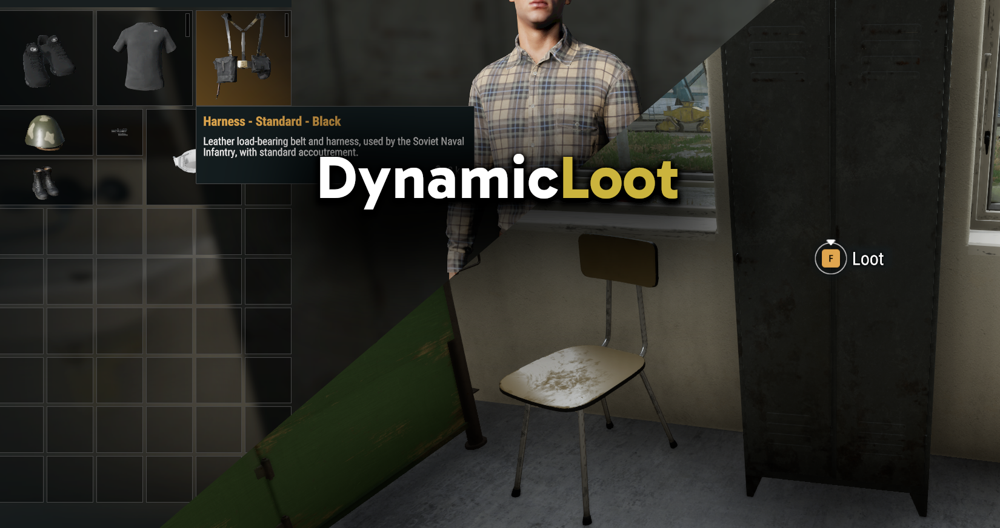

# DynamicLoot

## About
Arma Reforger loot system that dynamically reads loot items from EntityCatalogs and bases their rarity weighting on an inverse of supply cost, so cheaper items are more common and more expensive items are rarer automatically.

Any modded gear correctly added to EntityCatalogs of factions in the scenario's FactionManager will be available automatically.

Originally created to implement low-maintenance loot spawners in my FFA PvPvE game mode [MercOut!](https://reforger.armaplatform.com/workshop/64C4F3E0169E5739-MercOut) and to enable randomizing *any* gear for loadouts in [Randomized Loadout Manager](https://reforger.armaplatform.com/workshop/6556901E02CC05F2-RandomizedLoadoutManager), released stand-alone for others to use in their own game modes or servers 🙂

## Planned features:
 - Area spawner categorization (more likely to find medical stuff in hospitals, military gear at bases etc)
 - Gradual location-based rarity (further you get from spawn areas, the more rare items you'll find)

## Setup
 - If you're using a Systems Config file other than `ConflictSystems.conf` or `GameMasterSystems.conf`, make sure you add `DL_LootSystem` to it and drag-drop `DL_LootSystem.conf` onto the entry to apply the config
 - Create an override of `DL_LootSystem.conf`
 - Check the "Enable Loot Spawning" box
 - Tweak any other settings to your needs

## FAQ
### Why is modded gear I've added not spawning?
It's either not added to EntityCatalogs correctly or is added to catalogs for a faction not included in your scenario's FactionManager. Check the mod has overrides to add it's gear to EntityCatalogs, or for mods that add their gear to custom factions like RHS you will need to add these custom factions to your FactionManager for their gear to be picked up by DynamicLoot.

### How do I change rarity of spawned items?
Rarity is based on arsenal supply cost, so you can override the EntityCatalog configs (or FactionManager prefab) for factions with the relevant item and decrease supply cost to make items more common or increase it to make them rarer.

### Why is loot spawning disabled by default?
Because DL also functions as a framework/utility library for other mods to leverage DL's catalog merging and weighting behaviour such as [Randomized Loadout Manager](https://github.com/wyqydsyq/randomized-loadout-manager), this way mods like RLM can use it without forcing loot spawners on everyone who uses it

## License
APL - https://www.bohemia.net/community/licenses/arma-public-license